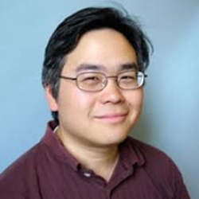

# Contact Info

<table><tr><td></td><td>
    <ul>
    <li>Eric Hsu, Professor and Chair, Mathematics Department </li>
    <li>Partner Director, Center for Science and Math Education  </li>
    <li>San Francisco State University, 1600 Holloway Avenue, San Francisco, CA 94132  </li>
    <li>erichsu@sfsu.edu</li>

</ul></td></tr></table>

# Meeting With Me
* For official advising, read [Advising for Math Teaching Concentration](AdvisingTeaching.md) and then schedule a meeting with me below.
* For info on how to become a teacher in California, also go to [Advising for Math Teaching Concentration](AdvisingTeaching.md). If you have a BA already, pay special attention to the end.
* For coursework evaluation for the math single-subject waiver program, read instructions at [Coursework Evaluation](CourseworkEvaluation.md).
 
* For scheduling a Zoom meeting with me, go to https://erichsu.youcanbook.me

# Curriculum Vitae
* My [Curriculum Vitae](CV.md) lists:
  * all past grant funded projects, with links to more information
  * publications, many with PDF links
  * presentations, some with linked talk notes
  * list of supervised theses and expository papers 
  * service activities

# Current Grants
* 6/1/2019-5/31/2024. co-PI, STAJES. NSF Noyce Track 1 #1852881. ($945,843 / 5y)
* Past grants are listed on my [Curriculum Vitae](CV.md).

# Teaching and Old Syllabuses
* [My Classes](MyClasses.md). Includes all past classes. 

# Math Education Essays and Talks

* [Getting a Math Education Job in a Mathematics Department (2014)](archive/hsu.pl@Getting_a_Math_Education_Job_in_a_Mathematics_Department.html)
* [Interviewing for a Math Ed Job in a Math Dept (2016)](archive/hsu.pl@Interviewing_for_a_Math_Ed_Job_in_a_Math_Dept.html)

<ul>
    <li><a class="url http outside" href="http://betterfilecabinet.com">The Better File Cabinet (math ed papers and
            calculus problems)</a></li>
    <li><a class="local" href="archive/hsu.pl@An_Outsider_Guide_to_Helping_Math_Faculty.html">An Outsider Guide to Helping Math
            Faculty</a>, 2017 discussion with CSU Faculty Development Council&nbsp;</li>
    <li><a class="local" href="archive/hsu.pl@Designing_Powerful_Calculus_Lessons.html">Designing Powerful Calculus Lessons</a>,
        workshops at Santa Clara University (2017), Cal State Maritime (2018).</li>
    <li><a href="archive/hsu.pl@Teaching_With_Group_Work_On_Large_Surfaces.html" class="local">Teaching With Group Work On Large
            Surfaces</a>, Joint Math Meetings 2017 Talk.&nbsp;</li>
    <li><a class="local" href="archive/hsu.pl@Calculus_I_With_Group_Work,_Fall_2008.html">Calculus I With Group Work, Fall
            2008</a> (Materials, worksheets, teaching outline) &nbsp;</li>
    <li><a class="local" href="archive/hsu.pl@Math_Education_Job_Search_Resources.html">Math Education Job Search Resources (a bit out of date)</a>
    </li>
    <li><a href="archive/hsu.pl@Math_Major_Percentages_By_Institution.html" class="local">Math Major Percentages By
            Institution</a></li>

  
</ul>

# Some Software and Web Sites I&#39;ve Written
<ul>
    <li><a href="archive/hsu.pl@LaTeX_Tidy.html" class="local">LaTeX Tidy</a>, open-source Perl hack to clean up LaTeX files
    </li>
    <li><a class="url http outside" href="http://macromates.com">TextMate</a>, a great Mac OS X text editor with special
        features for special text (e.g. programming languages). I wrote the initial Perl and LaTeX bundles, along with
        various other utilities.</li>
    <li><a class="local" href="archive/hsu.pl@Reading_Old_Microsoft_Word_5_Files_in_Mac_OS_X.html">Reading Old Microsoft Word 5
            Files in Mac OS X</a>. I&#39;m so proud to have figured it out, I had to record the details.&nbsp;</li>
</ul>

# Out of Date Creations But Maybe Interesting

* [Better File Cabinet](http://bfc.sfsu.edu/cgi-bin/bfc.pl), open-source wiki-database software.
* <a class="url http outside" href="archive/prob.pl@Treisman_Workshop_Resources.html">Emerging Scholars (Treisman) Intensive Workshop
            Resources</a> (Worksheets and TA Handbook)
<ul>
<li><a href="archive/../Subject_Matter_Requirement_Changes_for_CCSS.docx">California&nbsp;Subject&nbsp;Matter&nbsp;Requirements&nbsp;Changes&nbsp;for&nbsp;Common
            Core</a> (DOCX, updated Nov 5, 2013)</li>
<li><a href="https://docs.google.com/spreadsheet/ccc?key=0AnuJN_BYETiadEhULXBGUEdlNThiX3YyVFFrTVJQREE#gid=0"
            class="url http outside">List of U.S. Doctoral Programs in Math Education</a> (with RUME programs
        marked)(2016) &nbsp;</li>
<li><a href="https://sites.google.com/view/katie-waddle/resources/math-gre-resources">Katie Waddle&#39;s GRE Prep
            Resources (2019)</a></li>
<li><a class="local" href="archive/hsu.pl@Auto-Acronym.html">Auto-Acronym</a>. Automatic generation of acronyms from source
        text.</li>
</ul>

## Supplemental Instruction and Graduate TA Resources (out of date)

<ul>
    <li><a class="url http outside" href="archive/gta.pl.html">Remedial Algebra GTA Resource Site</a> (official syllabuses,
        teaching notes, activities and tests, Frequently Asked Questions)</li>
    <li><a class="url http outside" href="archive/prob.pl@Hypertext_UC_Berkeley_PDP_TA_Handbook.html">Hypertext UC Berkeley PDP
            TA Handbook</a> (Treisman Workshops)</li>
    <li><a class="url http outside" href="http://math.sfsu.edu/hsu/taguidelines.html">Official Guidelines for
            Fourth-Hour GTA Responsibilities</a></li>
</ul>

# Erdos-Bacon Number

Every now and then someone asks what my Erdos number is, and more rarely, what my Bacon number is. You can decide for
    yourself if my numbers are well-defined, as I use math education papers to calculate Erdos number and TV to
    calculate Bacon number. (Calculations done May 2010.)
    
* **My [Erdos Number](https://en.wikipedia.org/wiki/Erdős_number) is 4.** I coauthored with Diane
    Resek. /&nbsp;Diane Resek&nbsp;coauthored with&nbsp;L&eacute;on Henkin&nbsp;MR0366659 (51 #2906) / &nbsp;L&eacute;on
    Henkin&nbsp;coauthored with&nbsp;Alfred Tarski MR0124250 (23 #A1564) / Alfred Tarski&nbsp;coauthored with&nbsp;Paul
    Erd&ouml;s1&nbsp;MR0008249 (4,269b).

* **My [Bacon Number](https://en.wikipedia.org/wiki/Six_Degrees_of_Kevin_Bacon#Bacon_numbers) is 3**:
    When I was in the 7th grade,&nbsp;I was a regular member of a large kid panel on a TV show called <i>[Livewire](https://en.wikipedia.org/wiki/Livewire_(talk_show))</i>
    hosted by Fred Newman.&nbsp;Fred Newman (I) was in <i>Harry and the Hendersons</i>  with John Lithgow.&nbsp; John Lithgow
    was in <i>Footloose</i> with Kevin Bacon.
    
* Thus my **Erdos-Bacon Number is 7**.

* *Bonus*: **My [Black Sabbath Number](http://static.echonest.com/SixDegreesOfBlackSabbath/index.html") is
            17**:
Black Sabbath had member Neil Murray / Neil Murray was a member of Colosseum II / Colosseum II
        had member Gary Moore / Gary Moore was a member of BBM / BBM had member Ginger Baker / Ginger Baker was a member
        of Masters of Reality / Masters of Reality had member Victor Indrizzo / Victor Indrizzo was a member of Samiam /
        Samiam had member Tr&eacute; Cool / Tr&eacute; Cool was a member of Green Day / Green Day had member Billie Joe
        Armstrong / Billie Joe Armstrong was a member of Pinhead Gunpowder / Pinhead Gunpowder had member Aaron Cometbus
        / Aaron Cometbus was a member of Harbinger / Harbinger had member Robert Eggplant / Robert Eggplant was a member
        of the Hope Bombs / The Hope Bombs had member Eric Hsu.

* Therefore **my Erdos-Bacon-Sabbath number is 24**.
